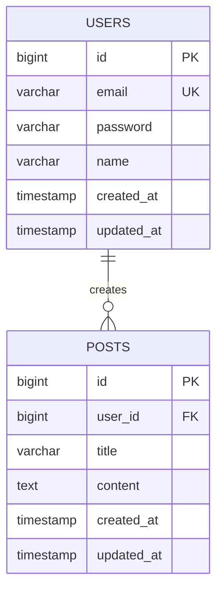

# 데이터베이스 설계서 (ERD)

> 최종 수정일: YYYY-MM-DD

## 📌 개요

데이터베이스 설계에 대한 개요를 작성합니다.

## 🗄 데이터베이스 정보

| 항목 | 값 |
|------|-----|
| DBMS | MySQL 8.0 |
| 인코딩 | utf8mb4 |
| Collation | utf8mb4_unicode_ci |

## 📊 ERD 다이어그램

## 📋 테이블 명세

### 1. users (사용자)

| 컬럼명 | 타입 | NULL | 기본값 | 설명 |
|--------|------|------|--------|------|
| id | BIGINT | NO | AUTO_INCREMENT | PK |
| email | VARCHAR(255) | NO | | 이메일 (UK) |
| password | VARCHAR(255) | NO | | 암호화된 비밀번호 |
| name | VARCHAR(100) | NO | | 이름 |
| created_at | TIMESTAMP | NO | CURRENT_TIMESTAMP | 생성일시 |
| updated_at | TIMESTAMP | YES | | 수정일시 |

**인덱스:**
- PRIMARY KEY (id)
- UNIQUE INDEX idx_email (email)

---

### 2. posts (게시글)

| 컬럼명 | 타입 | NULL | 기본값 | 설명 |
|--------|------|------|--------|------|
| id | BIGINT | NO | AUTO_INCREMENT | PK |
| user_id | BIGINT | NO | | FK → users.id |
| title | VARCHAR(255) | NO | | 제목 |
| content | TEXT | YES | | 내용 |
| created_at | TIMESTAMP | NO | CURRENT_TIMESTAMP | 생성일시 |
| updated_at | TIMESTAMP | YES | | 수정일시 |

**인덱스:**
- PRIMARY KEY (id)
- INDEX idx_user_id (user_id)

**외래키:**
- FOREIGN KEY (user_id) REFERENCES users(id) ON DELETE CASCADE

---

## 🔄 마이그레이션 이력

| 버전 | 날짜 | 설명 |
|------|------|------|
| V1.0 | | 초기 스키마 생성 |

## 📝 참고사항

- 모든 테이블에 created_at, updated_at 컬럼 필수
- 삭제는 soft delete 사용 (deleted_at 컬럼 추가)
- 대용량 테이블은 파티셔닝 고려
