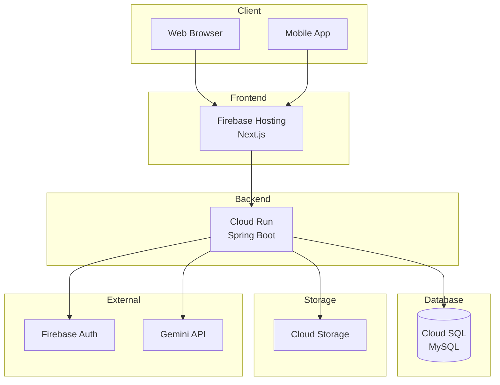
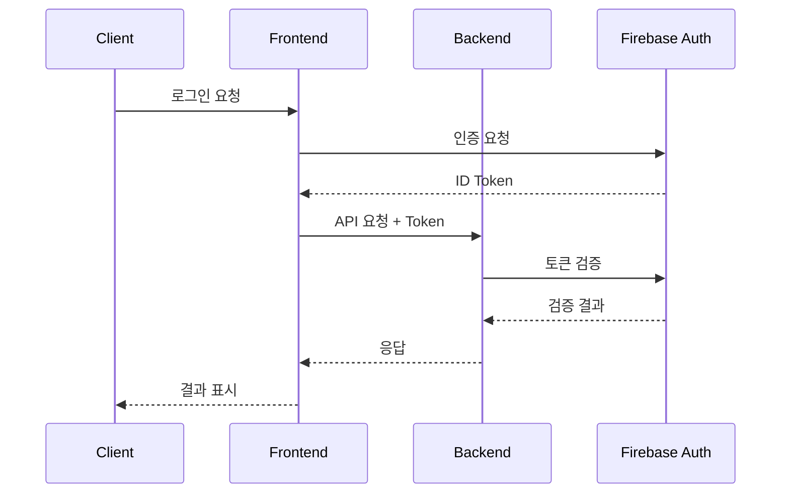
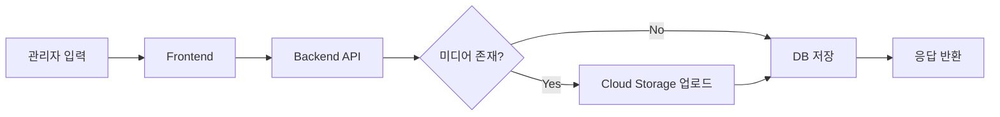
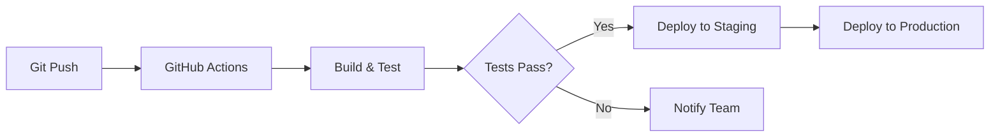

# 시스템 아키텍처

> 최종 수정일: YYYY-MM-DD

## 📌 개요

시스템 아키텍처에 대한 개요를 작성합니다.

## 🏗 시스템 구조

### 전체 아키텍처



## 🔧 기술 스택

### 프론트엔드

| 기술 | 버전 | 용도 |
|------|------|------|
| Next.js | 14.x | React 프레임워크 |
| TypeScript | 5.x | 타입 안정성 |
| Tailwind CSS | 3.x | 스타일링 |
| Zustand | 4.x | 상태 관리 |
| TanStack Query | 5.x | 서버 상태 관리 |

### 백엔드

| 기술 | 버전 | 용도 |
|------|------|------|
| Java | 17 | 런타임 |
| Spring Boot | 3.x | 웹 프레임워크 |
| Spring Security | 6.x | 인증/인가 |
| JPA/Hibernate | | ORM |
| Flyway | | DB 마이그레이션 |

### 인프라

| 서비스 | 용도 |
|--------|------|
| Firebase Hosting | 정적 파일 호스팅 |
| Cloud Run | 컨테이너 실행 |
| Cloud SQL | 관계형 DB |
| Cloud Storage | 파일 저장소 |

## 📁 디렉토리 구조

### 프론트엔드

```
frontend/
├── app/                    # Next.js App Router
│   ├── (public)/          # 공개 페이지
│   ├── admin/             # 관리자 페이지
│   └── api/               # API Routes
├── components/            # 재사용 컴포넌트
├── lib/                   # 유틸리티
├── hooks/                 # 커스텀 훅
└── types/                 # TypeScript 타입
```

### 백엔드

```
backend/
├── src/main/java/
│   └── com/example/
│       ├── config/        # 설정
│       ├── controller/    # API 컨트롤러
│       ├── service/       # 비즈니스 로직
│       ├── repository/    # 데이터 접근
│       ├── entity/        # JPA 엔티티
│       ├── dto/           # 데이터 전송 객체
│       └── exception/     # 예외 처리
└── src/main/resources/
    ├── application.yml    # 설정 파일
    └── db/migration/      # Flyway 마이그레이션
```

## 🔐 보안 구조

### 인증 흐름



### 권한 체계

| 역할 | 권한 |
|------|------|
| ADMIN | 모든 권한 |
| EDITOR | 콘텐츠 관리 |
| USER | 읽기 전용 |

## 📊 데이터 흐름

### 콘텐츠 생성 흐름



## 🔄 CI/CD 파이프라인



## 📝 설계 결정 사항

### ADR-001: Next.js App Router 사용

- **상황**: 프론트엔드 프레임워크 선택 필요
- **결정**: Next.js 14 App Router 사용
- **이유**: RSC 지원, 향상된 성능, 파일 기반 라우팅

### ADR-002: Cloud Run 선택

- **상황**: 백엔드 호스팅 플랫폼 선택 필요
- **결정**: Cloud Run 사용
- **이유**: 서버리스, 자동 스케일링, 비용 효율성

## 📝 참고사항

- 모든 서비스 간 통신은 HTTPS
- 민감 정보는 Secret Manager 사용
- 로그는 Cloud Logging으로 중앙화
