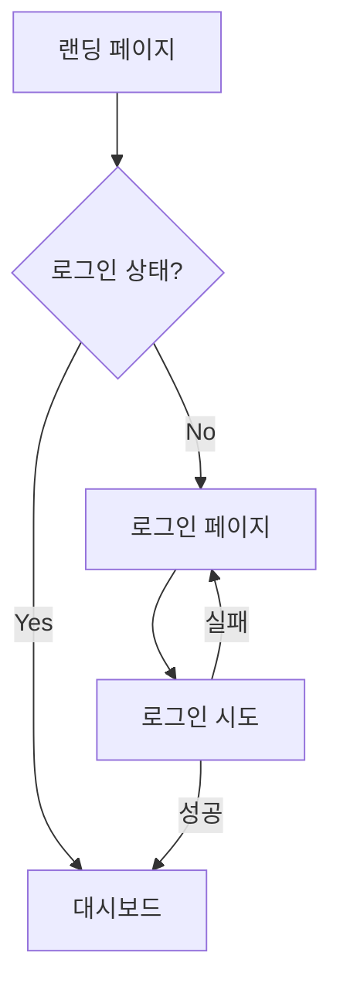

# 제품 요구사항 문서 (PRD)

> 문서 버전: 1.0  
> 최종 수정일: YYYY-MM-DD  
> 작성자: 

## 📌 개요

### 제품명
[제품/서비스 이름]

### 한 줄 설명
[제품이 무엇인지 한 문장으로 설명]

### 배경 및 목적
왜 이 제품을 만들어야 하는지, 어떤 문제를 해결하려고 하는지 설명합니다.

---

## 🎯 목표

### 비즈니스 목표
- [ ] 목표 1
- [ ] 목표 2

### 성공 지표 (KPI)
| 지표 | 현재 | 목표 | 측정 방법 |
|------|------|------|----------|
| MAU | - | | Google Analytics |
| 전환율 | - | | |
| 고객 만족도 | - | | |

---

## 👥 타겟 사용자

### 페르소나

#### 페르소나 1: [이름]
- **나이/직업**: 
- **특징**: 
- **니즈**: 
- **Pain Point**: 

#### 페르소나 2: [이름]
- **나이/직업**: 
- **특징**: 
- **니즈**: 
- **Pain Point**: 

---

## 📋 요구사항

### 기능 요구사항 (Functional Requirements)

#### FR-001: 사용자 인증
- **설명**: 사용자가 로그인/회원가입할 수 있어야 한다
- **우선순위**: P0 (필수)
- **상세**:
  - 이메일/비밀번호 로그인
  - 소셜 로그인 (Google, Kakao)
  - 비밀번호 찾기
- **수용 기준**:
  - [ ] 유효한 이메일로 로그인 시 대시보드로 이동
  - [ ] 잘못된 비밀번호 시 에러 메시지 표시

#### FR-002: [기능명]
- **설명**: 
- **우선순위**: P1
- **상세**:
  - 
- **수용 기준**:
  - [ ] 

### 비기능 요구사항 (Non-Functional Requirements)

#### NFR-001: 성능
- 페이지 로딩 시간 < 3초
- API 응답 시간 < 500ms
- 동시 접속자 1,000명 처리

#### NFR-002: 가용성
- 서비스 가용성 99.9%
- 장애 복구 시간 < 1시간

#### NFR-003: 보안
- HTTPS 필수
- 개인정보 암호화 저장
- OWASP Top 10 대응

---

## 🖼 화면 설계

### 와이어프레임

#### 메인 페이지
```
+----------------------------------+
|  로고      검색       로그인/가입  |
+----------------------------------+
|                                  |
|         히어로 섹션              |
|                                  |
+----------------------------------+
|   카드1    |   카드2   |   카드3  |
+----------------------------------+
|           푸터                    |
+----------------------------------+
```

### 사용자 흐름 (User Flow)



---

## 📅 마일스톤

| 단계 | 기간 | 목표 | 산출물 |
|------|------|------|--------|
| Phase 1 | 2주 | MVP 개발 | 핵심 기능 완료 |
| Phase 2 | 2주 | 베타 출시 | 내부 테스트 |
| Phase 3 | 1주 | 정식 출시 | 프로덕션 배포 |

---

## ⚠️ 위험 요소 및 대안

| 위험 요소 | 영향도 | 발생 확률 | 대안 |
|-----------|--------|-----------|------|
| 일정 지연 | 높음 | 중간 | 기능 축소 |
| 기술적 제약 | 중간 | 낮음 | 대안 기술 검토 |

---

## 📝 변경 이력

| 버전 | 날짜 | 작성자 | 변경 내용 |
|------|------|--------|----------|
| 1.0 | | | 초안 작성 |

---

## 📎 참고 자료

- [참고 링크 1]()
- [참고 링크 2]()
