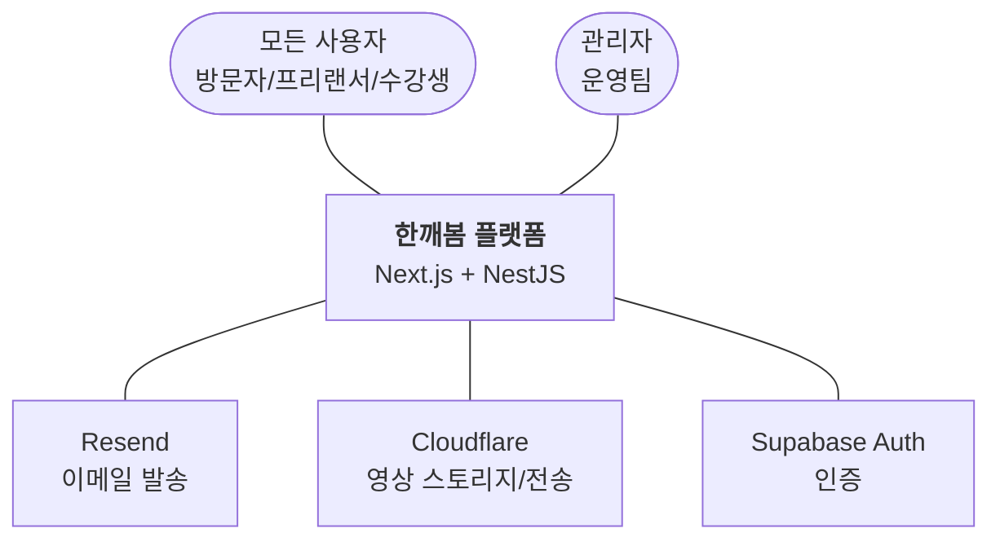
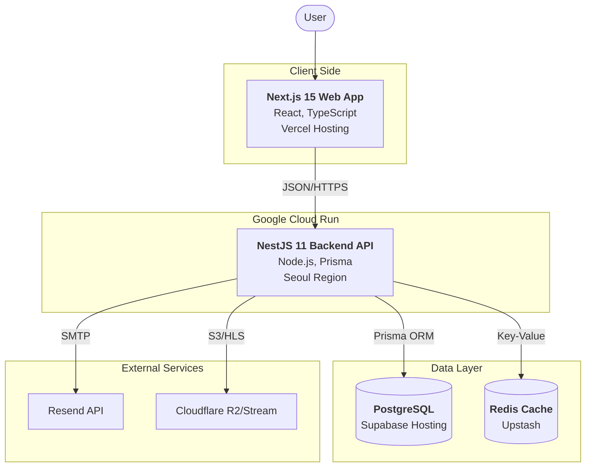
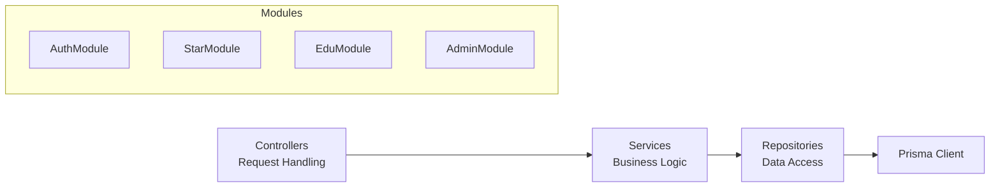

# 🏗️ C4 모델 다이어그램 (C4 Diagrams)

> **문서 버전**: 2026-01-19
> **기반**: `docs/02-architecture/OVERVIEW.md`

이 문서는 한깨봄 시스템의 구조를 **C4 모델(Context, Container, Component, Code)** 수준에 맞춰 시각화합니다.

---

## 1️⃣ Level 1: System Context Diagram (시스템 컨텍스트)

한깨봄 시스템이 외부 세계(사용자, 외부 서비스)와 어떻게 상호작용하는지 보여줍니다.

---

## 2️⃣ Level 2: Container Diagram (컨테이너)

한깨봄 프로젝트의 물리적 구성 요소(애플리케이션, 데이터베이스)와 기술 스택을 보여줍니다.

---

## 3️⃣ Level 3: Component Diagram (컴포넌트 - API 서버)

백엔드 서버 내부의 주요 모듈 구조입니다.

---

## 4️⃣ 다음 단계
*   상세 인터페이스 정의: [API 가이드](../03-api/README.md)
*   데이터 구조: [데이터베이스 스키마](./DATABASE_SCHEMA.md)
