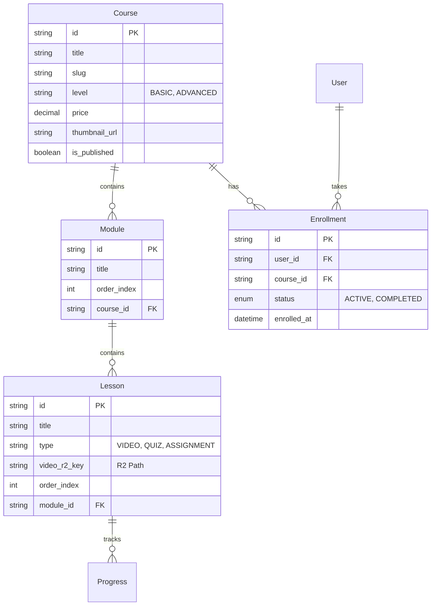
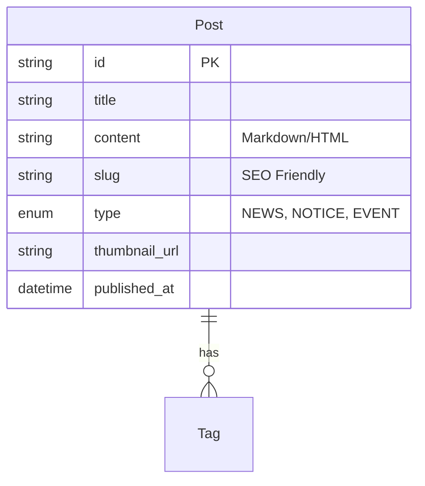

# Database Schema Design

## Overview
This schema is designed to support the 6 key business areas defined in the Sitemap.
It extends the existing Supabase (PostgreSQL) schema with new modules for **Education (LMS)** and **Content Management (News)**.

## 🏗️ Schema Modules

### 1. User & Auth (Base)
*Existing `User` model with Roles.*
- **Extensions**:
    - Profile extensions for `Stars` (Portfolio, Skills).
    - `Instructor` profile for Education? (Can use `Counselor` or `Admin`).

### 2. Education (LMS) 🆕
*Supporting `/education/` and `/lms/`*



### 3. Studio & Stars (Project Flow)
*Supporting `/stars/` and `/studio/`*
*Existing `Project` architecture is robust.*
- **Refinements**:
    - `Contest`: Can use `ProjectRequest` with `type=CONTEST`.
    - `Portfolio`: Filter `Project` where `status=COMPLETED` and `public_display=true`.

### 4. Content (News & Notice) 🆕
*Supporting `/news/` and `/help/`*



## 📝 Proposed Prisma Schema Addition

```prisma
// --- Education (LMS) ---
model Course {
  id          String   @id @default(cuid())
  title       String
  slug        String   @unique
  description String?  @db.Text
  level       String   // BASIC, ADVANCED
  price       Decimal  @default(0)
  isPublished Boolean  @default(false)
  
  modules     Module[]
  enrollments Enrollment[]
  
  createdAt   DateTime @default(now())
  updatedAt   DateTime @updatedAt
}

model Module {
  id        String   @id @default(cuid())
  title     String
  order     Int
  courseId  String
  course    Course   @relation(fields: [courseId], references: [id])
  lessons   Lesson[]
}

model Lesson {
  id          String   @id @default(cuid())
  title       String
  type        String   // VIDEO, TEXT, QUIZ
  content     String?  // Text content or JSON
  videoR2Key  String?  // R2 Key for video
  duration    Int?     // Seconds
  order       Int
  movieId     String
  module      Module   @relation(fields: [movieId], references: [id])
}

model Enrollment {
  id        String   @id @default(cuid())
  userId    String
  courseId  String
  status    String   // ACTIVE, COMPLETED
  progress  Int      @default(0) // %
  user      User     @relation(fields: [userId], references: [id])
  course    Course   @relation(fields: [courseId], references: [id])
  createdAt DateTime @default(now())
  
  @@unique([userId, courseId])
}

// --- Content ---
model Post {
  id          String   @id @default(cuid())
  title       String
  slug        String   @unique
  content     String   @db.Text
  type        String   // NEWS, NOTICE
  isPublished Boolean  @default(true)
  publishedAt DateTime @default(now())
}

// --- Counselors (Offline 500) ---
model Counselor {
  id          String   @id @default(cuid())
  
  // 1. Basic Identity
  name        String
  displayName String?  // 호명
  shortId     String?  @unique // 상담사ID
  phone       String?
  email       String?
  
  // 2. Profile & Content
  profileImageUrl String? // 이미지 주소/사진
  introduction    String? @db.Text // 소개글
  career          String? @db.Text // 경력사항
  notice          String? @db.Text // 공지사항
  
  // 3. Classification
  majorCategories String[] // 주요상담분야
  tags            String[] // 해시태그
  category        String?  // 분류
  region          String?
  
  // 4. Flags
  isKokkok        Boolean  @default(false) // 콕콕상담
  isDonation      Boolean  @default(false) // 기부상담
  isGift          Boolean  @default(false) // 선물상담
  hasRateIncrease Boolean  @default(false) // 인상참여
  attendedSession Boolean  @default(false) // 설명회참석
  isAdApplied     Boolean  @default(false) // 광고신청
  
  // 5. Metrics
  prevFee             Decimal? // 이전 이용료
  increasedFee        Decimal? // 인상 이용료
  targetTimeCurrent   Int?     // 현재 목표시간
  targetTimePrev      Int?     // 이전 목표시간
  targetTimeChallenge Int?     // 도전 목표시간
  waitingTime         Int?     // 대기시간
  
  status      String   @default("ACTIVE")
  
  // Management
  agencyId    String?
  manager     User?    @relation(fields: [agencyId], references: [id])
  
  projects    Project[]
  
  createdAt   DateTime @default(now())
  updatedAt   DateTime @updatedAt
}
```
