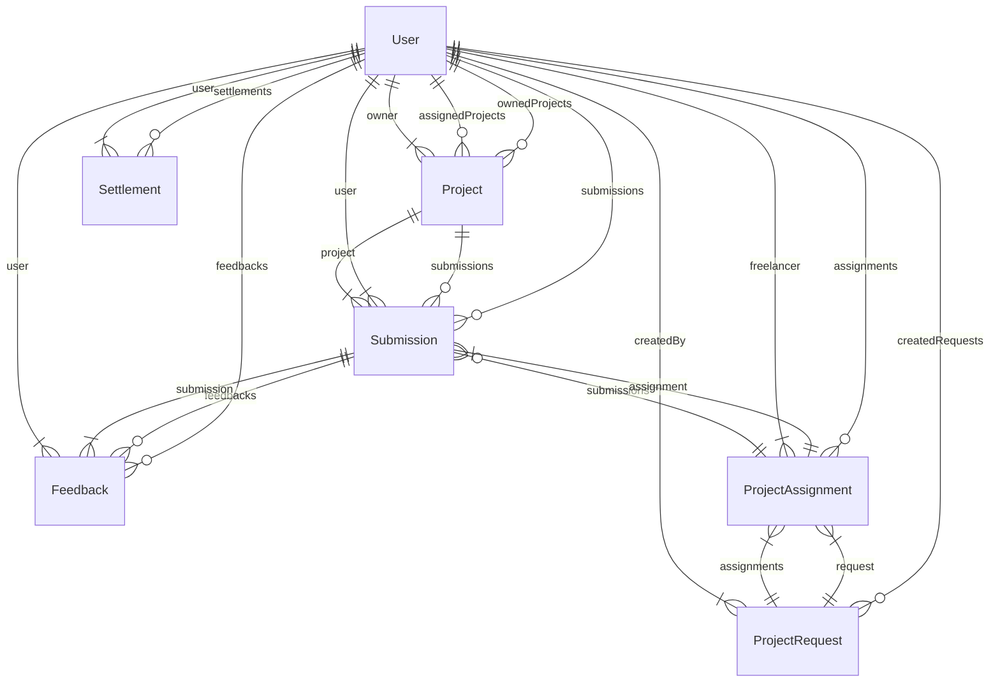

# 🗄️ 데이터베이스 스키마 (Database Schema)

> **Updated At**: 2026-01-19
> **Source**: `packages/database/prisma/schema.prisma`

이 문서는 프로젝트의 **실제 배포된 데이터베이스 구조**를 정의합니다.
PostgreSQL 기반이며, Prisma ORM을 통해 관리됩니다.

## 📐 ER Diagram (Entity-Relationship)

---

## 📚 Data Dictionary

### 1. User (사용자)
모든 시스템 사용자를 관리하는 핵심 테이블입니다.

`@@map("users")`

| Column | Type | Attributes | Description |
| :--- | :--- | :--- | :--- |
| `id` | String | **PK**, CUID | 고유 식별자 |
| `email` | String | Unique | 이메일 (로그인 ID) |
| `name` | String | | 사용자 이름 |
| `password` | String | | 암호화된 비밀번호 |
| `phone` | String? | | 전화번호 |
| `role` | Enum | Default: `STAR` | [UserRole](#enum-userrole) 참조 |
| `profileImage` | String? | | 프로필 이미지 URL (R2) |
| `isActive` | Boolean | Default: `true` | 계정 활성화 여부 |

### 2. ProjectRequest (제작 요청)
스타에게 영상 제작을 요청하는 "공고" 개념입니다.

`@@map("project_requests")`

| Column | Type | Attributes | Description |
| :--- | :--- | :--- | :--- |
| `id` | String | **PK**, CUID | 고유 식별자 |
| `title` | String | | 요청 제목 |
| `categories` | String[] | | 카테고리 태그 (브랜드, 코너 등) |
| `deadline` | DateTime | | 마감 기한 |
| `assignmentType` | Enum | Default: `MULTIPLE` | [AssignmentType](#enum-assignmenttype) 참조 |
| `maxAssignees` | Int | Default: `3` | 최대 배정 인원 |
| `status` | Enum | Default: `OPEN` | [RequestStatus](#enum-requeststatus) 참조 |
| `estimatedBudget`| Decimal | 12,2 | 예상 예산 |

### 3. ProjectAssignment (배정 내역)
특정 요청(`ProjectRequest`)에 프리랜서(`User`)가 배정된 관계 테이블입니다.

`@@map("project_assignments")`

| Column | Type | Attributes | Description |
| :--- | :--- | :--- | :--- |
| `id` | String | **PK**, CUID | 고유 식별자 |
| `requestId` | String | **FK** | 요청 ID |
| `freelancerId` | String | **FK** | 프리랜서 ID |
| `status` | Enum | Default: `ACCEPTED` | [AssignmentStatus](#enum-assignmentstatus) 참조 |

### 4. Submission (제출물)
프리랜서가 업로드한 영상 및 메타데이터입니다. 다중 버전 관리를 지원합니다.

`@@map("submissions")`

| Column | Type | Attributes | Description |
| :--- | :--- | :--- | :--- |
| `id` | String | **PK**, CUID | 고유 식별자 |
| `assignmentId` | String? | **FK** | 배정 ID |
| `userId` | String | **FK** | 제출자 ID |
| `versionSlot` | Int | Default: `1` | 버전 슬롯 (1~5) |
| `videoUrl` | String | | 스트리밍 URL (m3u8) |
| `fileKey` | String? | | R2 원본 파일 키 |
| `status` | Enum | Default: `PENDING` | [SubmissionStatus](#enum-submissionstatus) 참조 |

### 5. Feedback (피드백)
영상의 특정 구간(`startTime` ~ `endTime`)에 대한 피드백입니다.

`@@map("feedbacks")`

| Column | Type | Attributes | Description |
| :--- | :--- | :--- | :--- |
| `id` | String | **PK**, CUID | 고유 식별자 |
| `submissionId` | String | **FK** | 제출물 ID |
| `startTime` | Float? | | 시작 시간 (초) |
| `endTime` | Float? | | 종료 시간 (초) |
| `content` | String | | 피드백 내용 |
| `annotations` | Json? | | 화면 드로잉 좌표 데이터 |

### 6. Settlement (정산)
사용자에게 지급되거나 공제된 금액 내역입니다.

`@@map("settlements")`

| Column | Type | Attributes | Description |
| :--- | :--- | :--- | :--- |
| `id` | String | **PK**, CUID | 고유 식별자 |
| `userId` | String | **FK** | 대상 사용자 |
| `amount` | Decimal | 12,2 | 금액 |
| `type` | Enum | | [SettlementType](#enum-settlementtype) 참조 |
| `settlementRound`| Enum? | | 1차/2차 구분 |

---

## 🔢 Enums (열거형)

### Enum: UserRole
*   `ADMIN`: 슈퍼 관리자
*   `MOON_MANAGER`: 달 관리자 (통합)
*   `MOON_ADVERTISING`: 광고 관리자
*   `MOON_FEEDBACK`: 피드백 관리자
*   `MOON_SETTLEMENT`: 정산 관리자
*   `STAR`: 스타 (영상 제작자)
*   `COUNSELOR`: 상담사

### Enum: AssignmentType
*   `SINGLE`: 독점 (1명만 배정)
*   `MULTIPLE`: 중복 (여러 명 배정)

### Enum: RequestStatus
*   `OPEN`: 모집 중
*   `FULL`: 정원 마감
*   `CLOSED`: 마감
*   `CANCELLED`: 취소됨

### Enum: SubmissionStatus
*   `PENDING`: 대기중
*   `IN_REVIEW`: 검토중
*   `APPROVED`: 승인됨
*   `REJECTED`: 반려됨
*   `REVISED`: 수정요청

### Enum: SettlementType
*   `PAYOUT`: 지급
*   `DEDUCTION`: 공제
*   `BONUS`: 보너스
