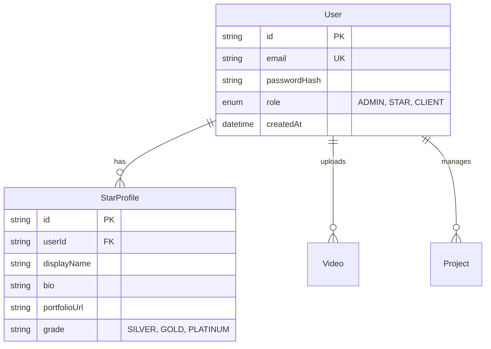
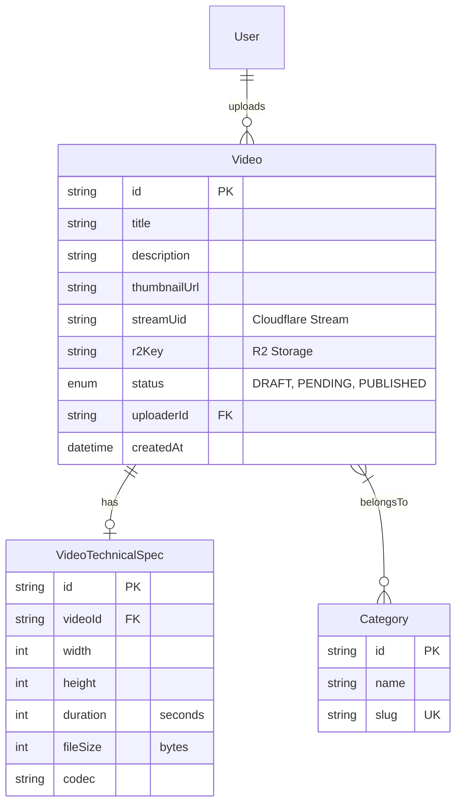
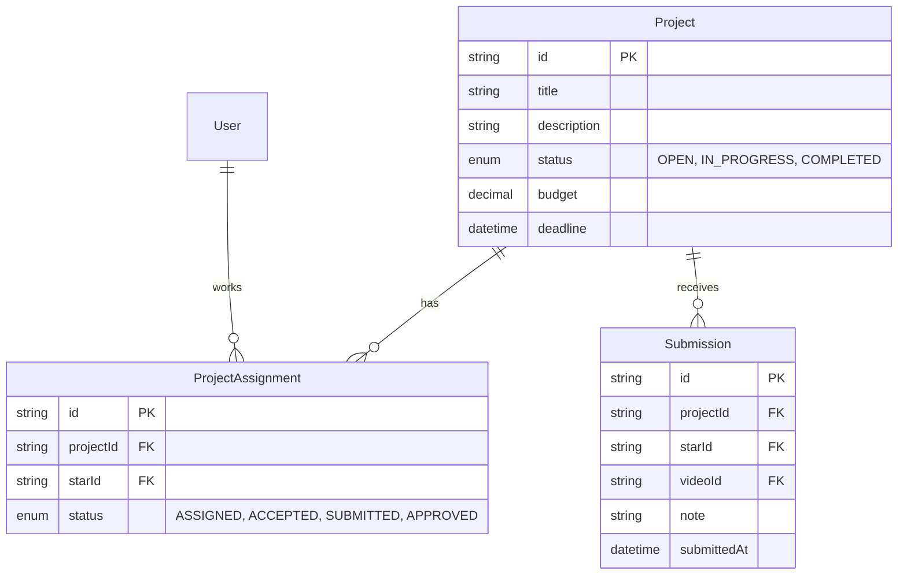
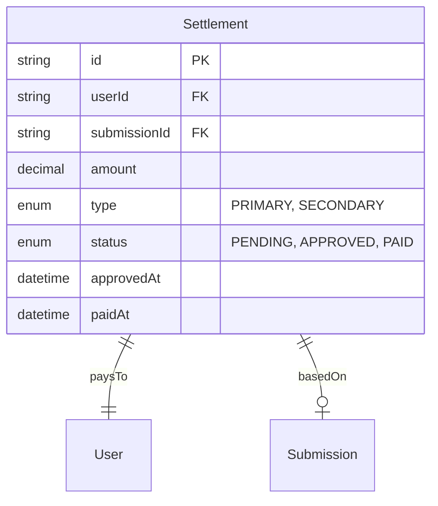

# Database Schema Design

> **문서 버전**: 2026-01-29
> **플랫폼 비전**: 영상 갤러리 + 프리랜서 + 관리자

## Overview

이 스키마는 함께봄 플랫폼의 3가지 핵심 영역을 지원합니다:
1. **영상 갤러리** - 넷플릭스 스타일 영상 시청
2. **프리랜서(Stars)** - 프로젝트 수주 및 영상 제작
3. **관리자(Admin)** - 검수/승인/정산

---

## 🏗️ 핵심 모델

### 1. User & Auth


```mermaid
erDiagram
    User ||--o{ StarProfile : has
    User ||--o{ Video : uploads
    User ||--o{ Project : manages

    User {
        string id PK
        string email UK
        string passwordHash
        enum role "ADMIN, STAR, CLIENT"
        datetime createdAt
    }
    StarProfile {
        string id PK
        string userId FK
        string displayName
        string bio
        string portfolioUrl
        string grade "SILVER, GOLD, PLATINUM"
    }
```

---

### 2. Videos (Gallery)


```mermaid
erDiagram
    Video ||--o| VideoTechnicalSpec : has
    Video }|--o{ Category : belongsTo
    User ||--o{ Video : uploads

    Video {
        string id PK
        string title
        string description
        string thumbnailUrl
        string streamUid "Cloudflare Stream"
        string r2Key "R2 Storage"
        enum status "DRAFT, PENDING, PUBLISHED"
        string uploaderId FK
        datetime createdAt
    }
    VideoTechnicalSpec {
        string id PK
        string videoId FK
        int width
        int height
        int duration "seconds"
        int fileSize "bytes"
        string codec
    }
    Category {
        string id PK
        string name
        string slug UK
    }
```

---

### 3. Projects & Assignments


```mermaid
erDiagram
    Project ||--o{ ProjectAssignment : has
    Project ||--o{ Submission : receives
    User ||--o{ ProjectAssignment : works

    Project {
        string id PK
        string title
        string description
        enum status "OPEN, IN_PROGRESS, COMPLETED"
        decimal budget
        datetime deadline
    }
    ProjectAssignment {
        string id PK
        string projectId FK
        string starId FK
        enum status "ASSIGNED, ACCEPTED, SUBMITTED, APPROVED"
    }
    Submission {
        string id PK
        string projectId FK
        string starId FK
        string videoId FK
        string note
        datetime submittedAt
    }
```

---

### 4. Settlements (정산)


```mermaid
erDiagram
    Settlement ||--|| User : paysTo
    Settlement ||--o| Submission : basedOn

    Settlement {
        string id PK
        string userId FK
        string submissionId FK
        decimal amount
        enum type "PRIMARY, SECONDARY"
        enum status "PENDING, APPROVED, PAID"
        datetime approvedAt
        datetime paidAt
    }
```

---

## 📝 Prisma Schema (Core)

```prisma
// --- User ---
model User {
  id            String   @id @default(cuid())
  email         String   @unique
  passwordHash  String
  role          String   @default("CLIENT") // ADMIN, STAR, CLIENT
  
  profile       StarProfile?
  videos        Video[]
  settlements   Settlement[]
  
  createdAt     DateTime @default(now())
  updatedAt     DateTime @updatedAt
}

model StarProfile {
  id            String   @id @default(cuid())
  userId        String   @unique
  displayName   String
  bio           String?
  portfolioUrl  String?
  grade         String   @default("SILVER") // SILVER, GOLD, PLATINUM
  
  user          User     @relation(fields: [userId], references: [id])
}

// --- Video ---
model Video {
  id            String   @id @default(cuid())
  title         String
  description   String?
  thumbnailUrl  String?
  streamUid     String?  // Cloudflare Stream
  r2Key         String?  // R2 Storage path
  status        String   @default("DRAFT") // DRAFT, PENDING, PUBLISHED
  
  uploaderId    String
  uploader      User     @relation(fields: [uploaderId], references: [id])
  
  technicalSpec VideoTechnicalSpec?
  categories    Category[]
  
  createdAt     DateTime @default(now())
  updatedAt     DateTime @updatedAt
}

model VideoTechnicalSpec {
  id        String @id @default(cuid())
  videoId   String @unique
  width     Int?
  height    Int?
  duration  Int?   // seconds
  fileSize  Int?   // bytes
  codec     String?
  
  video     Video  @relation(fields: [videoId], references: [id])
}

// --- Project ---
model Project {
  id          String   @id @default(cuid())
  title       String
  description String?
  status      String   @default("OPEN") // OPEN, IN_PROGRESS, COMPLETED
  budget      Decimal?
  deadline    DateTime?
  
  assignments ProjectAssignment[]
  submissions Submission[]
  
  createdAt   DateTime @default(now())
}

model ProjectAssignment {
  id        String @id @default(cuid())
  projectId String
  starId    String
  status    String @default("ASSIGNED") // ASSIGNED, ACCEPTED, SUBMITTED, APPROVED
  
  project   Project @relation(fields: [projectId], references: [id])
  
  @@unique([projectId, starId])
}

// --- Settlement ---
model Settlement {
  id           String   @id @default(cuid())
  userId       String
  amount       Decimal
  type         String   // PRIMARY, SECONDARY
  status       String   @default("PENDING") // PENDING, APPROVED, PAID
  
  user         User     @relation(fields: [userId], references: [id])
  
  approvedAt   DateTime?
  paidAt       DateTime?
  createdAt    DateTime @default(now())
}
```

---

## 🔄 핵심 워크플로우

```
Project 생성 (Admin)
       ↓
ProjectAssignment 생성 (Star 배정)
       ↓
Submission 생성 (Star 업로드)
       ↓
Admin 검토/승인
       ↓
┌──────┴──────┐
↓             ↓
Video.status  Settlement 생성
= PUBLISHED   (APPROVED)
```
