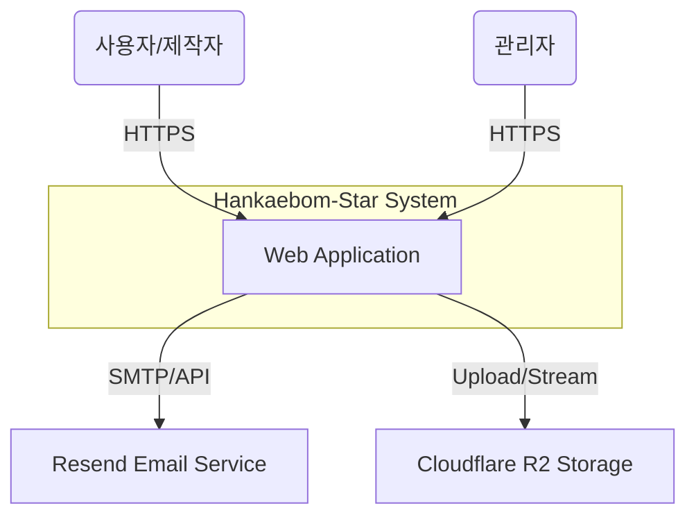

# 🏗️ 시스템 아키텍처 (System Architecture)

> **Updated At**: 2026-01-19
> **Standard**: [C4 Model](https://c4model.com/)

이 문서는 프로젝트의 소프트웨어 아키텍처를 **Context (배경)**, **Containers (컨테이너)**, **Components (컴포넌트)** 3단계로 시각화하여 정의합니다.

## Level 1: System Context Diagram

시스템과 외부 사용자/시스템 간의 상호작용을 보여줍니다.



## Level 2: Container Diagram

애플리케이션의 물리적 배포 단위와 통신 프로토콜을 보여줍니다.

```mermaid
graph TD
    User([Browser]) -->|HTTPS| CDN[Cloudflare CDN]
    CDN -->|Next.js| Frontend[Apps/Web\n(Vercel - Seoul)]
    
    Frontend -->|REST/Socket.io| Backend[Apps/Api\n(Cloud Run - Seoul)]
    
    subgraph "Backend Services"
        Backend -->|Prisma| DB[(PostgreSQL\nSupabase)]
        Backend -->|Redis| Cache[(Upstash Redis)]
        Backend -->|Queue| Worker[BullMQ Worker]
    end
    
    Frontend -->|Direct Upload| R2[Cloudflare R2]
    R2 -->|Stream| Stream[Cloudflare Stream]
```

## Level 3: Component Diagram (Monorepo Structure)

Turborepo 기반의 모노레포 내부 의존성 구조입니다.

| 구분 | 패키지명 | 설명 | 비고 |
| :--- | :--- | :--- | :--- |
| **Apps** | `apps/web` | Next.js 15 프론트엔드 | 사용자/관리자 UI |
| | `apps/api` | NestJS 11 백엔드 | REST API & Socket 서버 |
| **Packages** | `packages/ui` | Shared UI Library | 디자인 시스템 (Tailwind) |
| | `packages/database` | Prisma Schema & Client | DB 모델 정의 |
| | `packages/types` | Shared TypeScript Types | DTO/Entity 타입 공유 |
| | `packages/utils` | Common Utilities | 날짜/포맷팅 헬퍼 함수 |

## 🚀 배포 파이프라인 (CI/CD)

*   **Frontend**: Git Push -> Vercel 자동 빌드 및 배포
*   **Backend**: Git Push -> GitHub Actions -> Docker Build -> Google Artifact Registry -> Cloud Run Deploy

## 🔐 주요 인프라 설정

*   **Vercel**: Next.js App Router, Server Actions 활용
*   **Cloud Run**: Min-Instance 0 (비용 최적화), Max-Instance 10 (오토스케일링)
*   **Supabase**: Connection Pooling (Transaction Mode) 필수 사용 (`6543` 포트)
