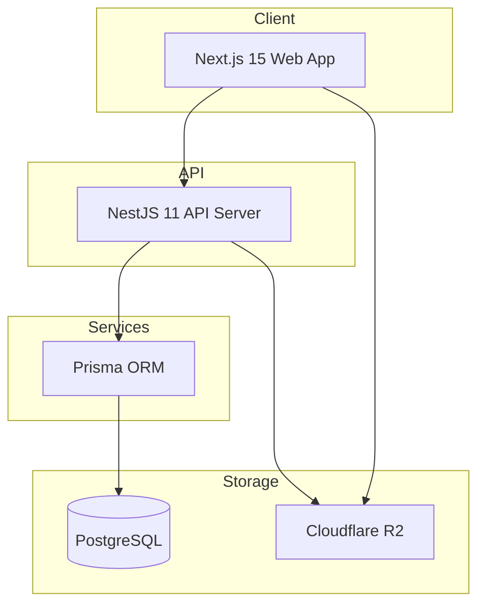
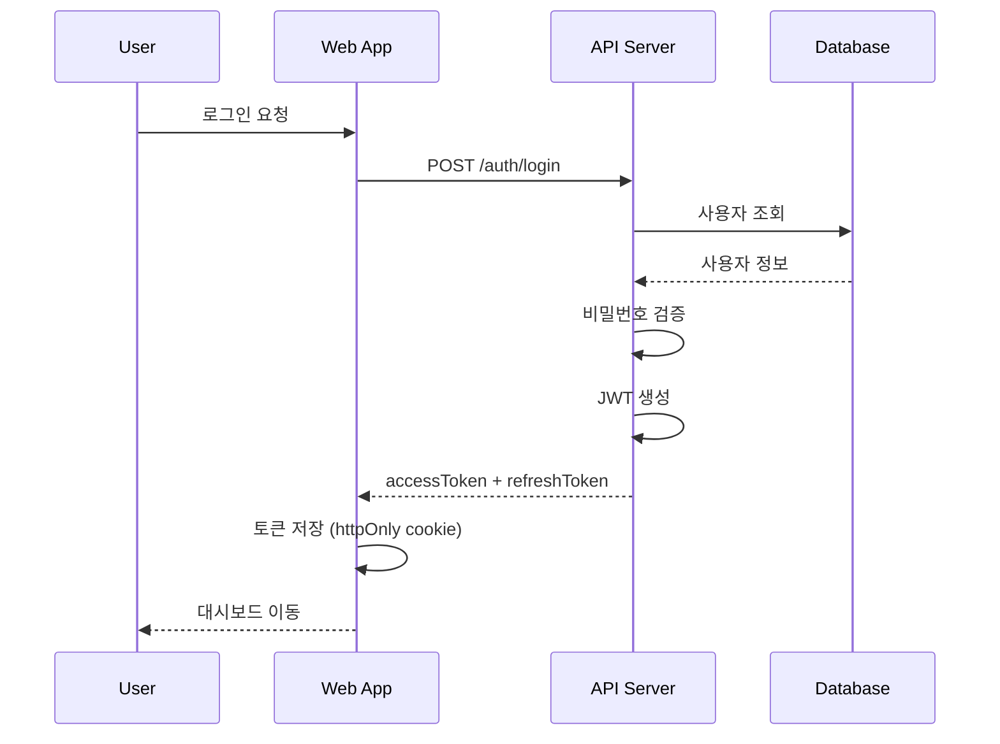
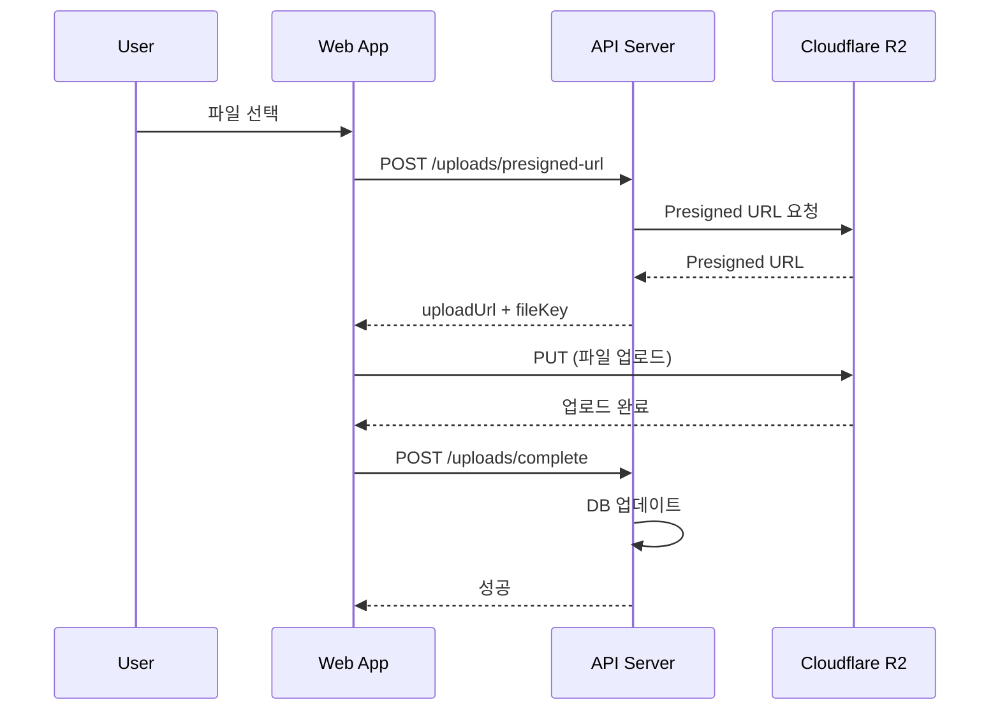

# 🏗️ 시스템 아키텍처

> Ask the Stars 플랫폼 기술 아키텍처 문서

---

## 📊 아키텍처 개요



---

## 📁 프로젝트 구조

```
Ask-the-Stars/
├── apps/
│   ├── web/                  # Next.js 15 프론트엔드
│   │   ├── src/
│   │   │   ├── app/         # App Router 페이지
│   │   │   │   ├── (auth)/  # 인증 페이지
│   │   │   │   ├── (dashboard)/
│   │   │   │   │   ├── stars/      # 프리랜서
│   │   │   │   │   ├── moon/       # 운영팀
│   │   │   │   │   └── counselor/  # 상담사
│   │   │   │   └── (public)/       # 공개 페이지
│   │   │   ├── components/  # 공통 컴포넌트
│   │   │   ├── hooks/       # 커스텀 훅
│   │   │   ├── lib/         # 유틸리티
│   │   │   └── stores/      # Zustand 스토어
│   │   └── package.json
│   │
│   └── api/                  # NestJS 11 백엔드
│       ├── src/
│       │   ├── modules/     # 도메인 모듈
│       │   │   ├── auth/
│       │   │   ├── projects/
│       │   │   ├── submissions/
│       │   │   ├── feedbacks/
│       │   │   ├── settlements/
│       │   │   └── uploads/
│       │   ├── common/      # 공통 (guards, filters)
│       │   └── main.ts
│       └── package.json
│
├── packages/
│   ├── database/            # Prisma 스키마
│   │   ├── prisma/
│   │   │   └── schema.prisma
│   │   └── package.json
│   │
│   ├── shared/              # 공유 타입/유틸
│   └── ui/                  # 공유 UI 컴포넌트
│
├── docs/                    # 문서
├── .github/                 # GitHub Actions
└── package.json             # 루트 (pnpm workspace)
```

---

## 🔧 기술 스택

### 프론트엔드

| 기술 | 버전 | 용도 |
|------|------|------|
| Next.js | 15 | React 프레임워크 |
| React | 19 | UI 라이브러리 |
| TypeScript | 5.x | 타입 안정성 |
| Tailwind CSS | 4.x | 스타일링 |
| Zustand | 5.x | 상태 관리 |
| TanStack Query | 5.x | 서버 상태 관리 |
| Plyr | 3.x | 비디오 플레이어 |
| Fabric.js | 6.x | 캔버스 어노테이션 |

### 백엔드

| 기술 | 버전 | 용도 |
|------|------|------|
| NestJS | 11 | 서버 프레임워크 |
| Prisma | 6.x | ORM |
| PostgreSQL | 16 | 데이터베이스 |
| Passport | - | 인증 |
| Cloudflare R2 | - | 파일 스토리지 |

---

## 🔐 인증 흐름



---

## 📤 영상 업로드 흐름



---

## 👥 역할별 권한

| 역할 | 코드 | 권한 |
|------|------|------|
| 슈퍼 관리자 | ADMIN | 모든 권한 |
| 달 관리자 | MOON_MANAGER | 제작요청, 프리랜서 관리 |
| 광고 관리자 | MOON_ADVERTISING | 캠페인 관리 |
| 피드백 관리자 | MOON_FEEDBACK | 검수, 피드백 |
| 정산 관리자 | MOON_SETTLEMENT | 정산 처리 |
| 프리랜서 | STAR | 제작요청 수락, 제출 |
| 상담사 | COUNSELOR | 영상 요청, 조회 |

---

## 🌐 배포 환경

| 환경 | URL | 용도 |
|------|-----|------|
| Development | localhost:3000/3001 | 로컬 개발 |
| Staging | staging.askthestars.com | QA 테스트 |
| Production | askthestars.com | 운영 |

### 인프라 구성

```
┌─────────────────┐
│   Cloudflare    │
│   (CDN + R2)    │
└────────┬────────┘
         │
┌────────┴────────┐
│   Vercel        │  ← Next.js
└────────┬────────┘
         │
┌────────┴────────┐
│   Railway/      │  ← NestJS
│   Fly.io        │
└────────┬────────┘
         │
┌────────┴────────┐
│   Supabase/     │  ← PostgreSQL
│   Railway       │
└─────────────────┘
```

---

## 📊 모니터링

- **에러 추적**: Sentry
- **성능 모니터링**: Vercel Analytics
- **로그**: Railway/Fly.io 내장 로깅
- **알림**: Slack Webhook
