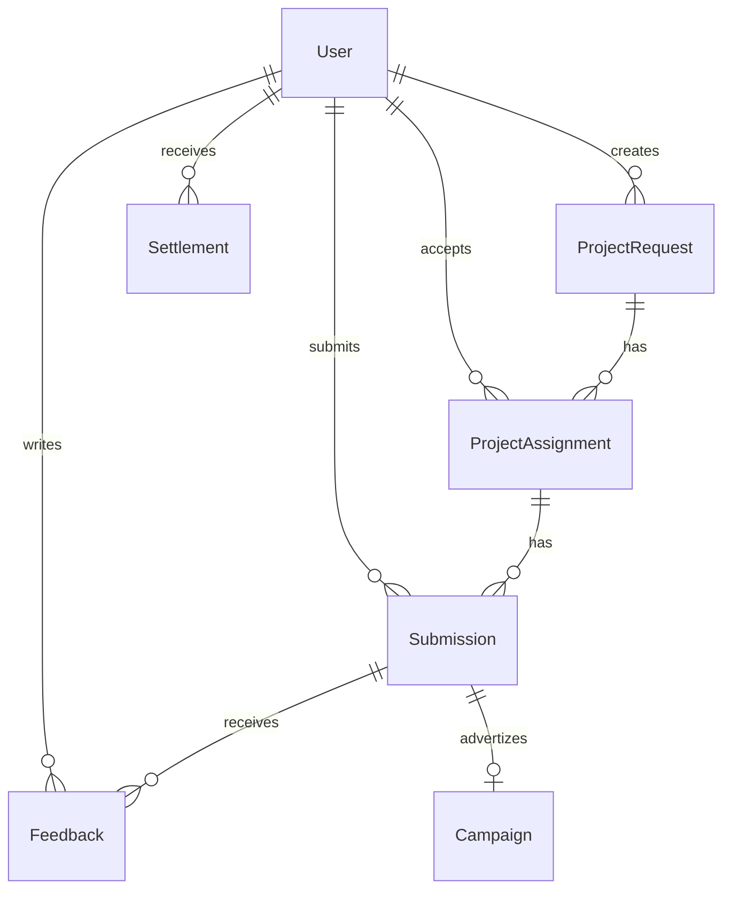

# 🗄️ 데이터베이스 스키마

> Ask the Stars 플랫폼 PostgreSQL 데이터베이스 스키마 문서

---

## 📊 ERD 개요



---

## 👤 User (사용자)

| 컬럼 | 타입 | 설명 |
|------|------|------|
| id | cuid | PK |
| email | varchar | 이메일 (unique) |
| name | varchar | 이름 |
| password | varchar | 해시된 비밀번호 |
| phone | varchar? | 전화번호 |
| role | UserRole | 역할 |
| profile_image | varchar? | 프로필 이미지 URL |
| bio | text? | 자기소개 |
| is_active | boolean | 활성 여부 |
| created_at | timestamp | 생성일 |
| updated_at | timestamp | 수정일 |

### UserRole (역할)

```
ADMIN           - 슈퍼 관리자
MOON_MANAGER    - 달 관리자 (통합)
MOON_ADVERTISING - 광고 관리자
MOON_FEEDBACK   - 피드백 관리자
MOON_SETTLEMENT - 정산 관리자
STAR            - 프리랜서 (영상 제작자)
COUNSELOR       - 상담사
```

---

## 📋 ProjectRequest (제작요청)

| 컬럼 | 타입 | 설명 |
|------|------|------|
| id | cuid | PK |
| title | varchar | 제목 |
| description | text? | 설명 |
| categories | text[] | 카테고리 배열 |
| deadline | timestamp | 마감일 |
| assignment_type | AssignmentType | 독점/중복 |
| max_assignees | int | 최대 인원 (기본: 3) |
| current_assignees | int | 현재 수락 인원 |
| status | RequestStatus | 상태 |
| estimated_budget | decimal(12,2)? | 예상 예산 |
| requirements | text? | 제작 가이드라인 |
| reference_urls | text[] | 참고 URL |
| target_counselor_id | cuid? | 대상 상담사 ID |
| created_by_id | cuid | 생성자 ID (FK → User) |
| created_at | timestamp | 생성일 |
| updated_at | timestamp | 수정일 |

### AssignmentType
```
SINGLE   - 독점 (1명만)
MULTIPLE - 중복 (여러 명)
```

### RequestStatus
```
OPEN      - 모집 중
FULL      - 정원 마감
CLOSED    - 마감
CANCELLED - 취소됨
```

---

## 🤝 ProjectAssignment (수락 내역)

| 컬럼 | 타입 | 설명 |
|------|------|------|
| id | cuid | PK |
| request_id | cuid | 요청 ID (FK → ProjectRequest) |
| freelancer_id | cuid | 프리랜서 ID (FK → User) |
| accepted_at | timestamp | 수락 시간 |
| status | AssignmentStatus | 상태 |
| created_at | timestamp | 생성일 |
| updated_at | timestamp | 수정일 |

**Unique Constraint:** `(request_id, freelancer_id)`

### AssignmentStatus
```
ACCEPTED    - 수락됨
IN_PROGRESS - 진행중
SUBMITTED   - 제출완료
COMPLETED   - 완료
CANCELLED   - 취소
```

---

## 📤 Submission (제출물)

| 컬럼 | 타입 | 설명 |
|------|------|------|
| id | cuid | PK |
| project_id | cuid? | 프로젝트 ID (레거시) |
| assignment_id | cuid? | 수락 ID (FK → ProjectAssignment) |
| user_id | cuid | 제출자 ID (FK → User) |
| version_slot | int | 버전 슬롯 (1~5) ⭐ |
| version_title | varchar? | 버전 제목 (예: "경쾌한 톤") |
| version | int | 리비전 번호 |
| video_url | varchar | 영상 URL |
| file_key | varchar? | R2 파일 키 |
| duration | int? | 영상 길이 (초) |
| thumbnail_url | varchar? | 썸네일 URL |
| status | SubmissionStatus | 상태 |
| notes | text? | 메모 |
| created_at | timestamp | 생성일 |
| updated_at | timestamp | 수정일 |

**Unique Constraint:** `(assignment_id, version_slot)`

### SubmissionStatus
```
PENDING   - 대기중
IN_REVIEW - 검토중
APPROVED  - 승인됨
REJECTED  - 반려됨
REVISED   - 수정요청
```

---

## 💬 Feedback (피드백)

| 컬럼 | 타입 | 설명 |
|------|------|------|
| id | cuid | PK |
| submission_id | cuid | 제출물 ID (FK → Submission) |
| user_id | cuid | 작성자 ID (FK → User) |
| start_time | float? | 시작 시간 (초) |
| end_time | float? | 종료 시간 (초) |
| timestamp | float? | 단일 타임스탬프 (하위 호환) |
| feedback_type | varchar? | 유형 (자막/BGM/컷편집/색보정) |
| content | text | 피드백 내용 |
| priority | FeedbackPriority | 우선순위 |
| status | FeedbackStatus | 상태 |
| annotations | jsonb? | 화면 마킹 데이터 |
| created_at | timestamp | 생성일 |
| updated_at | timestamp | 수정일 |

### FeedbackPriority
```
LOW, NORMAL, HIGH, URGENT
```

### FeedbackStatus
```
PENDING  - 대기중
RESOLVED - 해결됨
WONTFIX  - 수정안함
```

---

## 💰 Settlement (정산)

| 컬럼 | 타입 | 설명 |
|------|------|------|
| id | cuid | PK |
| user_id | cuid | 수령자 ID (FK → User) |
| submission_id | cuid? | 제출물 ID |
| amount | decimal(12,2) | 금액 |
| type | SettlementType | 유형 |
| settlement_round | SettlementRound? | 1차/2차 |
| status | SettlementStatus | 상태 |
| description | text? | 설명 |
| quarter_year | int? | 연도 (2026) |
| quarter_number | int? | 분기 (1-4) |
| processed_at | timestamp? | 처리 시간 |
| created_at | timestamp | 생성일 |
| updated_at | timestamp | 수정일 |

### SettlementRound
```
PRIMARY   - 1차 정산 (제작비)
SECONDARY - 2차 정산 (인센티브)
```

---

## 📣 Campaign (캠페인)

| 컬럼 | 타입 | 설명 |
|------|------|------|
| id | cuid | PK |
| name | varchar | 캠페인명 |
| submission_id | cuid? | 제출물 ID |
| platform | text[] | 플랫폼 (YouTube, Instagram, etc.) |
| budget | decimal(12,2) | 예산 |
| start_date | timestamp | 시작일 |
| end_date | timestamp | 종료일 |
| target_audience | jsonb? | 타겟 오디언스 |
| status | CampaignStatus | 상태 |
| views | int | 조회수 |
| clicks | int | 클릭수 |
| conversions | int | 전환수 |
| created_at | timestamp | 생성일 |
| updated_at | timestamp | 수정일 |

---

## 🔗 인덱스

```sql
-- 자주 사용되는 쿼리 최적화

CREATE INDEX idx_project_requests_status ON project_requests(status);
CREATE INDEX idx_project_requests_deadline ON project_requests(deadline);

CREATE INDEX idx_submissions_assignment ON submissions(assignment_id);
CREATE INDEX idx_submissions_status ON submissions(status);

CREATE INDEX idx_feedbacks_submission ON feedbacks(submission_id);
CREATE INDEX idx_feedbacks_status ON feedbacks(status);

CREATE INDEX idx_settlements_user ON settlements(user_id);
CREATE INDEX idx_settlements_round ON settlements(settlement_round);
```

---

## 📝 마이그레이션

```bash
# 개발 환경
cd packages/database
pnpm prisma migrate dev --name add-sitemap-models

# 운영 환경
pnpm prisma migrate deploy
```
