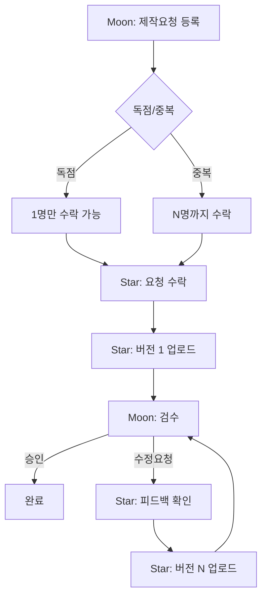
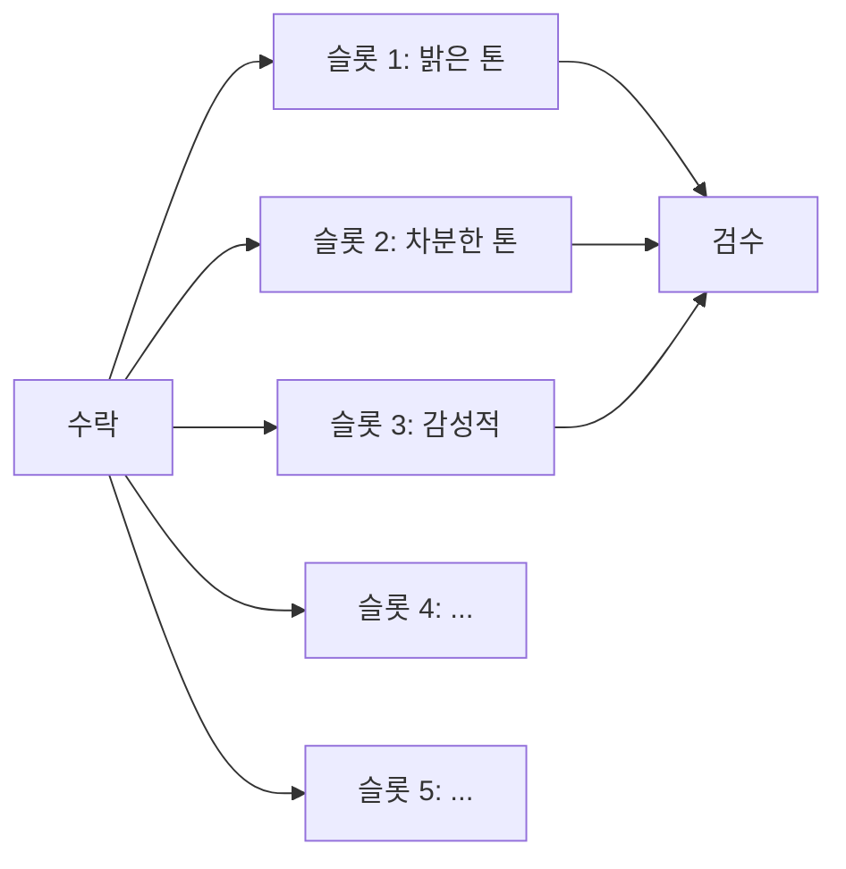
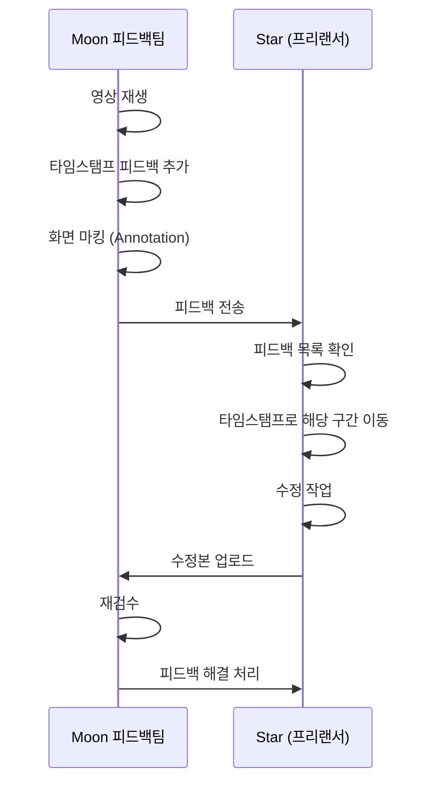
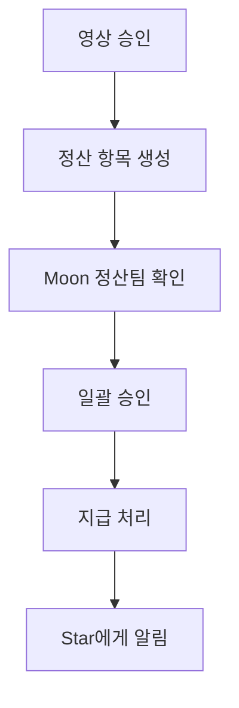
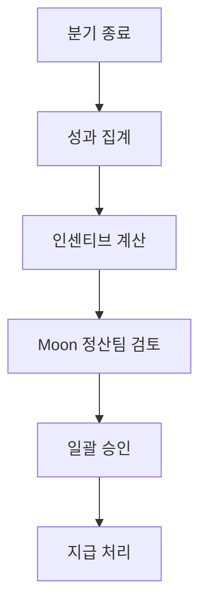
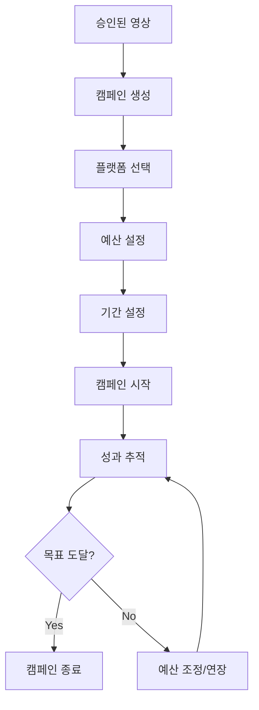
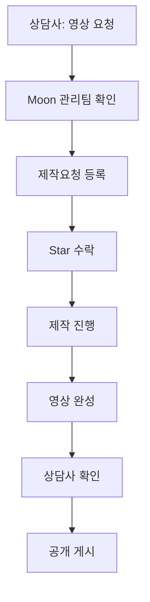

# 🔄 워크플로우

> Ask the Stars 플랫폼 핵심 업무 프로세스

---

## 📋 제작요청 워크플로우

### 단계별 설명

| # | 담당자 | 액션 | 페이지 |
|---|--------|------|--------|
| 1 | Moon 관리 | 제작요청 등록 | `/moon/management/project-requests/create` |
| 2 | Star | 게시판에서 요청 확인 | `/stars/project-board` |
| 3 | Star | 요청 수락 | `/stars/request-detail/[id]` |
| 4 | Star | 영상 업로드 (버전 1~5) | `/stars/upload` |
| 5 | Moon 피드백 | 영상 검수 | `/moon/feedback/video-review/[id]` |
| 6 | Star | 피드백 확인 및 수정 | `/stars/feedback` |
| 7 | Moon 피드백 | 최종 승인/반려 | `/moon/feedback/review-queue` |

---

## 🎬 다중 버전 제출 워크플로우

### 버전 슬롯 규칙

1. 프리랜서는 **1~5개** 버전 제출 가능
2. 각 슬롯은 고유한 **버전 제목** 부여 (예: "경쾌한 톤")
3. 각 슬롯 내에서 **리비전** 가능 (v1.0 → v1.1)
4. 독립적으로 승인/반려 처리

---

## 💬 피드백 워크플로우

### 피드백 유형

| 유형 | 설명 | 예시 |
|------|------|------|
| 자막 | 자막 위치, 크기, 오타 | "10초~15초 자막 위치 조정" |
| BGM | 배경음악 볼륨, 선곡 | "BGM 30% 낮춰주세요" |
| 컷편집 | 장면 전환, 길이 | "인트로 3초 더 짧게" |
| 색보정 | 색감, 밝기 | "전체적으로 밝게 보정" |

---

## 💰 정산 워크플로우

### 1차 정산 (제작비)

| 타이밍 | 조건 | 금액 |
|--------|------|------|
| 영상 승인 직후 | 승인된 버전당 | 예상 예산 (제작요청에 명시) |

### 2차 정산 (인센티브)

| 기준 | 보너스 |
|------|--------|
| 조회수 10K+ | +₩10,000 |
| 조회수 50K+ | +₩30,000 |
| 전환율 5%+ | +₩30,000 |
| 분기 MVP | +₩100,000 |

---

## 📣 광고 캠페인 워크플로우

### 성과 지표

| 지표 | 설명 | 목표 |
|------|------|------|
| Views | 조회수 | 높을수록 좋음 |
| CTR | 클릭률 | 3% 이상 |
| CPC | 클릭당 비용 | ₩200 이하 |
| Conversions | 전환 (상담 예약) | 높을수록 좋음 |
| CPA | 전환당 비용 | ₩5,000 이하 |

---

## 🔮 상담사 영상 요청 워크플로우

### 요청 폼 단계

1. **Step 1**: 기본 정보 (컨셉, 타겟)
2. **Step 2**: 스타일 선택 (밝은/차분/감성)
3. **Step 3**: 확인 및 제출
